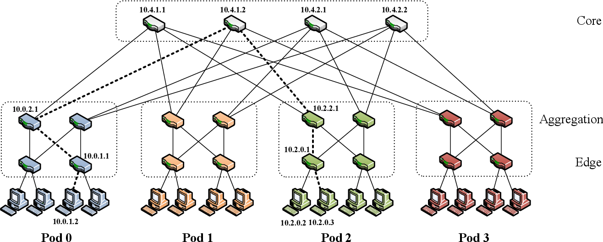

# SDN Slice Setup Optimization

This repository contains the source code for the project of the course Networking II (Softwarized and Virtualized Mobile Networks) at the University of Trento.

Goal of the project is to develop a RYU-based SDN controller to slice the network, dynamically re-allocate services and schedule new routes in order to maintain the desired QoS. The simulation is based on [Mininet](http://mininet.org/), a realistic virtual network running real kernel, switch and application code on a [Comnetsemu](https://git.comnets.net/public-repo/comnetsemu) Virtual Machine.

**Author**: Samuele Pozzani (samuele.pozzani@studenti.unitn.it)

# Topology

Software-defined networking (SDN) technology is a new approach to network architectures that enables efficient network configuration and improves performance and monitoring, mostly oriented to cloud computing. A first important step for this project consists of developing a network topology that simulates a real-world scenario in a modern data center.

The class contained in `network/topology.py` implements a special instance of a Clos topology called *Fat-Tree* to interconnect commodity ethernet switches, as described in the research article [*"A scalable, commodity data center network architecture"* (Mohammad Al-Fares et al., 2008)](https://dl.acm.org/doi/10.1145/1402946.1402967). The topology is described by a single parameter $K$ (number of pods, and ports of the switches). An instance of this architecture that employs 48-port Ethernet switches is capable of providing full bandwidh to up 27,648 hosts. The following image shows the first non-trivial Fat-Tree instance (with $K = 4$) used for the simulations in this project.

 

IP addresses of edge and aggregation switches are `10.pod.switch.1` where switches are numbered left to right and bottom to top. Core switches IP addresses are `10.k.j.i` where $K$ is the topology parameter, $j$ and $i$ denote the coordinates of the switch in the $(k/2)^2$ core switch grid starting from top-left. Servers have IP addresses of the form `10.pod.switch.serverID`.     

# SDN Controller

The SDN Controller is implemented using [RYU SDN Framework](https://ryu-sdn.org/) which provides well defined APIs to manage network switches using the OpenFlow protocol version 1.5.

## Two-Level Routing

To provide level 3 connectivity between all the hosts in the network, RYU is configured to implement the Two-Level Routing mechanism presented in the paper, using FlowTables instead of the classical routing tables. 

## SDN Network Slicing

The first level of switches (edge) act as a filtering traffic diffuser. When the simulation starts, the edge switches are configured to ask the controller for a rule to forward the packets. The controller first checks if the source host is allowed to communicate with the destination based on the slices defined in `network/params.py`. If allowed by the policy, the controller installs a FlowTable entry to the edge switch to forward the packet, otherwise the packet is dropped. 

## Flow Scheduler

The flow scheduler is started by the RYU controller and runs as a separate software thread. Its execution loop includes the following stages:

- Send OpenFlow port stats requests to core switches 
- Analyze port stats replies to estimate the presence of data flows running through the core switches 
- Update the TTL field for the detected flows
- **TODO**: Create a new rule on the pod switches to redirect the flow through an unused path
- **TODO**: In case an unused path cannot be found, migrate the service to an available host and update network slices 

# Running the Simulation

Add repo to pythonpath using `$ export PYTHONPATH=/path/to/repo`  
Run Ryu controller using `$ ryu run network/controller.py`  
Create topology and run simulation using `$ sudo python3 mininet_simulation.py`   
Delete mininet status using `$ sudo mn -c`   
Kill all containers using `$ docker rm -f $(docker ps -a -q)`  
Build dockerfile using `$ docker build -t service_migration --file ./Dockerfile .`   
Build dev_test using `$ docker build -t dev_test --file ./Dockerfile.dev_test .`  

# Acknowledgments

<a href="https://www.unitn.it/"></a>

## Doxygen docs

To generate Doxygen documentation, install Doxygen and execute:  

```bash
$ doxygen Doxyfile
``` 

HTML docs will be generated inside the `docs` folder.

## Copyright

MIT Licence or otherwise specified. See [license](./LICENSE.txt) file for details.