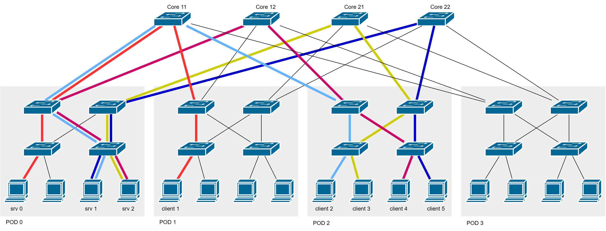

# Scenario 2

In this scenario, three services and five clients are spawned in the network as shown in the schema below. Clients 1 and 2 create two flows going through core switch c11 to pod 0, therefore a single congested downlink is identified. Clients 3, 4 and 5 create flows running though core switch c21, c12, c22 respectively, hence the downlinks to pod 0 are considered busy. 

The flow scheduler searches for a new path to re-route traffic between clients 1 and 2 and services 0 and 1. Since no paths are available, the scheduler migrates the service 0 to from pod 0 to pod 1, so that an intrapod communication is created between client 1 and service 0 and the congestion on core switch c11 is eliminated.  

```
Before migration:
client_1 (pod 1) -> core c11 -> service_0 (pod 0)   <-- First flow on c11
client_2 (pod 2) -> core c11 -> service_1 (pod 0)   <-- Second flow on c11
client_3 (pod 2) -> core c21 -> service_2 (pod 0)  
client_4 (pod 2) -> core c12 -> service_2 (pod 0)  
client_5 (pod 2) -> core c22 -> service_1 (pod 0)  

After migration:
client_1 (pod 1) -> intrapod -> service_0 (pod 1)   
client_2 (pod 2) -> core c11 -> service_1 (pod 0)   <-- Only flow on c11
client_3 (pod 2) -> core c21 -> service_2 (pod 0)  
client_4 (pod 2) -> core c12 -> service_2 (pod 0)  
client_5 (pod 2) -> core c22 -> service_1 (pod 0)  
```



## Known Issues

Clients are not considered when a host is searched for service migration, therefore a new container can be spawned inside a host with another running container.

# Parameters

```python
# network/globals.py
FAT_TREE_K = 4

slices = {
    0: ['10.0.0.2', '10.1.0.2',],
    1: ['10.0.1.2', '10.2.0.2', '10.2.1.3',],
    2: ['10.0.1.3', '10.2.0.3', '10.2.1.2',],
}

clients = [
    ('c1', 'p1_s0_h2', '0'),
    ('c2', 'p2_s0_h2', '1'),
    ('c3', 'p2_s0_h3', '2'),
    ('c4', 'p2_s1_h2', '2'),
    ('c5', 'p2_s1_h3', '1'),
]

services = {
    '0': '10.0.0.2',
    '1': '10.0.1.2',
    '2': '10.0.1.3',
}
```

# Mininet Output


```
Created service 0 on host 10.0.0.2
Created service 1 on host 10.0.1.2
Created service 2 on host 10.0.1.3

...

Migrated service 0 to host 10.1.0.2
```

# Controller Output

```
Flow on switch c22 from pod 2 to pod 0
Flow on switch c22 from pod 0 to pod 2
Flow on switch c12 from pod 2 to pod 0
Flow on switch c12 from pod 0 to pod 2
Flow on switch c11 from pod 1 to pod 0
Flow on switch c11 from pod 2 to pod 0
Flow on switch c11 from pod 0 to pod 1
Flow on switch c21 from pod 2 to pod 0
Discovered congested downlink on c11 to pod 0

=============== Core Switch Port Statistics ===============
c22 :
         Port 1: [ TX: 4890     RX: 18760 ]
         Port 2: [ TX: 70       RX: 70 ]
         Port 3: [ TX: 18830    RX: 4820 ]
         Port 4: [ TX: 0        RX: 70 ]
c12 :
         Port 1: [ TX: 4890     RX: 18830 ]
         Port 2: [ TX: 70       RX: 70 ]
         Port 3: [ TX: 18760    RX: 4890 ]
         Port 4: [ TX: 70       RX: 70 ]
c11 :
         Port 1: [ TX: 9710     RX: 9450 ]
         Port 2: [ TX: 9450     RX: 4890 ]
         Port 3: [ TX: 70       RX: 4890 ]
         Port 4: [ TX: 70       RX: 0 ]
c21 :
         Port 1: [ TX: 4890     RX: 70 ]
         Port 2: [ TX: 0        RX: 0 ]
         Port 3: [ TX: 0        RX: 4890 ]
         Port 4: [ TX: 0        RX: 0 ]
=============== =========================== ===============

...

Found available core switch: c22            <-- Starting migration procedure
Found available host: 10.1.0.2
Moved service 0 to host 10.1.0.2
Slices are already correctly setup
Create path to 10.1.0.2 via c22

...

Flow on switch c22 from pod 2 to pod 0
Flow on switch c22 from pod 0 to pod 2
Flow on switch c12 from pod 2 to pod 0
Flow on switch c12 from pod 0 to pod 2
Flow on switch c11 from pod 2 to pod 0
Flow on switch c21 from pod 2 to pod 0

=============== Core Switch Port Statistics ===============
c22 :
         Port 1: [ TX: 4820     RX: 18830 ]
         Port 2: [ TX: 0        RX: 0 ]
         Port 3: [ TX: 18760    RX: 4890 ]
         Port 4: [ TX: 70       RX: 0 ]
c12 :
         Port 1: [ TX: 4820     RX: 18760 ]
         Port 2: [ TX: 0        RX: 70 ]
         Port 3: [ TX: 18830    RX: 4820 ]
         Port 4: [ TX: 0        RX: 70 ]
c11 :
         Port 1: [ TX: 4820     RX: 0 ]
         Port 2: [ TX: 0        RX: 0 ]
         Port 3: [ TX: 0        RX: 4820 ]
         Port 4: [ TX: 70       RX: 70 ]
c21 :
         Port 1: [ TX: 4820     RX: 0 ]
         Port 2: [ TX: 70       RX: 70 ]
         Port 3: [ TX: 70       RX: 4820 ]
         Port 4: [ TX: 70       RX: 70 ]
=============== =========================== ===============
```
