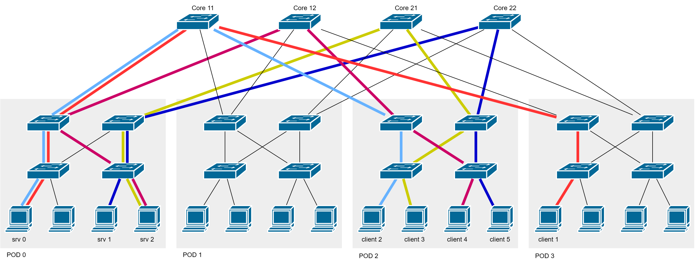

# Scenario 4

This scenario is similar to number 2, except client 1 is moved to pod 3 and target services are different for each client. As in the previous case, there are no available paths to solve the congestion on the downlink between core switch c11 and pod 0, therefore service 0 is migrated to pod 1. 

In this case, there are still the same two clients that are generating traffic, hence a new congestion is created on the downlink between core switch c11 and pod 1. This time, the flow scheduler finds an available path through core switch c21, traffic is re-routed, and the congestions are considered solved.  

This scenario exposes the weaknesses of the simplified method used to estimate flows and detect congestions, and the flow scheduling algorithm. Indeed, after the optimization, the scenario has actually been made worse, with a new congested uplink.  

```
Before migration:
client_1 (pod 3) -> core c11 -> service_0 (pod 0)   <-- First flow on c11
client_2 (pod 2) -> core c11 -> service_0 (pod 0)   <-- Second flow on c11
client_3 (pod 2) -> core c21 -> service_2 (pod 0)  
client_4 (pod 2) -> core c12 -> service_2 (pod 0)  
client_5 (pod 2) -> core c22 -> service_1 (pod 0)  

After migration:
client_1 (pod 3) -> core c11 -> service_0 (pod 1)   <-- First flow on c11
client_2 (pod 2) -> core c11 -> service_0 (pod 1)   <-- Second flow on c11
client_3 (pod 2) -> core c21 -> service_2 (pod 0)  
client_4 (pod 2) -> core c12 -> service_2 (pod 0)  
client_5 (pod 2) -> core c22 -> service_1 (pod 0)  

After path update:
client_1 (pod 3) -> core c21 -> service_0 (pod 1)   <-- First flow on c21
client_2 (pod 2) -> core c21 -> service_0 (pod 1)   <-- Second flow on c21
client_3 (pod 2) -> core c21 -> service_2 (pod 0)  
client_4 (pod 2) -> core c12 -> service_2 (pod 0)  
client_5 (pod 2) -> core c22 -> service_1 (pod 0)  
```

Before migration:


After migration:


After path update:


## Known Issues

Due to the very simple flow estimation algorithm that has been implemented for this project, in the last stage of this scenario it is not possible to correctly detect the flows, indeed the congested downlink from core switch c21 to pod 1 is not discovered. This issue can be fixed by considering other information about the forwarded packets other than the amount of bytes, for instance the used protocols, and the source and destination of the traffic.  

Another issue is given by the simple flow scheduling algorithm that cannot schedule two different paths for the two clients generating traffic to the same service. 

# Parameters

```python
# network/globals.py
FAT_TREE_K = 4

slices = {
    0: ['10.0.0.2', '10.3.0.2', '10.2.0.2',],
    1: ['10.0.1.2', '10.2.1.3',],
    2: ['10.0.1.3', '10.2.0.3', '10.2.1.2',],
}

clients = [
    ('c1', 'p3_s0_h2', '0'),
    ('c2', 'p2_s0_h2', '0'),
    ('c3', 'p2_s0_h3', '2'),
    ('c4', 'p2_s1_h2', '2'),
    ('c5', 'p2_s1_h3', '1'),
]

services = {
    '0': '10.0.0.2',
    '1': '10.0.1.2',
    '2': '10.0.1.3',
}
```

# Mininet Output


```
Created service 0 on host 10.0.0.2
Created service 1 on host 10.0.1.2
Created service 2 on host 10.0.1.3

...

Migrated service 0 to host 10.1.0.2
```

# Controller Output

```
Flow on switch c11 from pod 2 to pod 0
Flow on switch c11 from pod 3 to pod 0
Flow on switch c11 from pod 0 to pod 2
Flow on switch c11 from pod 0 to pod 3
Flow on switch c21 from pod 2 to pod 0
Flow on switch c12 from pod 2 to pod 0
Flow on switch c12 from pod 0 to pod 2
Flow on switch c22 from pod 2 to pod 0
Flow on switch c22 from pod 0 to pod 2
Discovered congested downlink on c11 to pod 0       <-- Detected a congested downlink

=============== Core Switch Port Statistics ===============
c11 :
         Port 1: [ TX: 9640     RX: 18760 ]
         Port 2: [ TX: 0        RX: 0 ]
         Port 3: [ TX: 9380     RX: 4820 ]
         Port 4: [ TX: 9380     RX: 4820 ]
c21 :
         Port 1: [ TX: 4820     RX: 0 ]
         Port 2: [ TX: 0        RX: 0 ]
         Port 3: [ TX: 0        RX: 4890 ]
         Port 4: [ TX: 0        RX: 0 ]
c12 :
         Port 1: [ TX: 4820     RX: 18760 ]
         Port 2: [ TX: 0        RX: 0 ]
         Port 3: [ TX: 18760    RX: 4820 ]
         Port 4: [ TX: 0        RX: 0 ]
c22 :
         Port 1: [ TX: 4820     RX: 9380 ]
         Port 2: [ TX: 0        RX: 0 ]
         Port 3: [ TX: 9380     RX: 4820 ]
         Port 4: [ TX: 0        RX: 0 ]
=============== =========================== ===============

...

Found available core switch: c11
Found available host: 10.1.0.2
Moved service 0 to host 10.1.0.2
Added host 10.1.0.2 to slice 0                      <-- Update slices
Create path to 10.1.0.2 via c11                     <-- Update path to service 0

...

Flow on switch c11 from pod 2 to pod 1
Flow on switch c11 from pod 3 to pod 1
Flow on switch c11 from pod 1 to pod 2
Flow on switch c11 from pod 1 to pod 3
Flow on switch c21 from pod 2 to pod 0
Flow on switch c12 from pod 2 to pod 0
Flow on switch c12 from pod 0 to pod 2
Flow on switch c22 from pod 2 to pod 0
Flow on switch c22 from pod 0 to pod 2
Discovered congested downlink on c11 to pod 1       <-- Detected a different congested downlink

=============== Core Switch Port Statistics ===============
c11 :
         Port 1: [ TX: 0        RX: 0 ]
         Port 2: [ TX: 2890     RX: 4238 ]
         Port 3: [ TX: 2146     RX: 1482 ]
         Port 4: [ TX: 2092     RX: 1408 ]
c21 :
         Port 1: [ TX: 4820     RX: 0 ]
         Port 2: [ TX: 0        RX: 0 ]
         Port 3: [ TX: 0        RX: 4890 ]
         Port 4: [ TX: 0        RX: 0 ]
c12 :
         Port 1: [ TX: 4338     RX: 18760 ]
         Port 2: [ TX: 0        RX: 0 ]
         Port 3: [ TX: 18760    RX: 4338 ]
         Port 4: [ TX: 0        RX: 0 ]
c22 :
         Port 1: [ TX: 4820     RX: 8442 ]
         Port 2: [ TX: 0        RX: 0 ]
         Port 3: [ TX: 8442     RX: 4820 ]
         Port 4: [ TX: 0        RX: 0 ]
=============== =========================== ===============

...

Found available core switch: c21
Create path to 10.1.0.2 via c21                     <-- Update path to service 0

...

Flow on switch c11 from pod 1 to pod 2
Flow on switch c11 from pod 1 to pod 3
Flow on switch c21 from pod 2 to pod 0  
Flow on switch c21 from pod 2 to pod 1              
Flow on switch c12 from pod 2 to pod 0  
Flow on switch c12 from pod 0 to pod 2  
Flow on switch c22 from pod 2 to pod 0  
Flow on switch c22 from pod 0 to pod 2              (no congestions detected)

=============== Core Switch Port Statistics ===============
c11 :
         Port 1: [ TX: 0        RX: 0 ]
         Port 2: [ TX: 0        RX: 18760 ]
         Port 3: [ TX: 9380     RX: 0 ]
         Port 4: [ TX: 9380     RX: 0 ]
c21 :
         Port 1: [ TX: 4820     RX: 0 ]
         Port 2: [ TX: 9640     RX: 0 ]
         Port 3: [ TX: 0        RX: 9640 ]
         Port 4: [ TX: 0        RX: 4820 ]
c12 :
         Port 1: [ TX: 4820     RX: 18760 ]
         Port 2: [ TX: 0        RX: 0 ]
         Port 3: [ TX: 18760    RX: 4820 ]
         Port 4: [ TX: 0        RX: 0 ]
c22 :
         Port 1: [ TX: 4820     RX: 9380 ]
         Port 2: [ TX: 0        RX: 0 ]
         Port 3: [ TX: 9380     RX: 4820 ]
         Port 4: [ TX: 0        RX: 0 ]
=============== =========================== ===============
```
